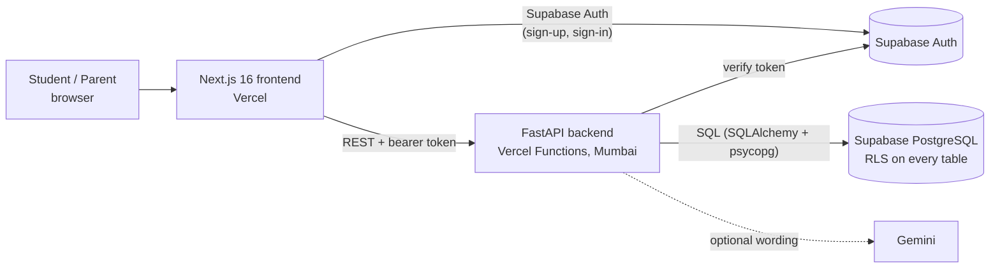

# NextPath · PRISM Engine

**A career plan the whole family agrees on.** NextPath combines a student's strengths, their family's budget and
real job-market data into one ranked, affordable career roadmap for Indian students.

Built by team **Keyboard Warriors** for **DataQuest 3.0**, problem **DQNM**.

| | |
| --- | --- |
| Live app | https://nextpath-prism.vercel.app |
| API (OpenAPI docs) | https://nextpath-prism-api.vercel.app/docs |
| Presentation | [docs/PRISM-Engine.pptx](docs/PRISM-Engine.pptx) |
| Scoring formulas | [docs/backend-guide.md, section 4](docs/backend-guide.md#4-the-logic-you-must-build) |

## The problem

Career choices in Indian families are often made on hearsay. The student's aptitude, the parents' budget and the
job market are rarely looked at together. When the student and parents disagree, nobody can see where the gap is.

## How it works

1. **Student:** creates an account, picks their Class 11–12 stream (PCM, PCB, PCMB, Commerce with or without
   Maths, Arts, or "not decided yet") and a few preferences, and answers a 33-question assessment: 23 statements
   on a 1–5 scale and 10 graded aptitude questions, covering 13 traits.
2. **Parent:** joins with the student's invite code and enters the budget, savings, the largest acceptable loan,
   how many years they can wait to recover the cost, and their top 3 career areas.
3. **Together:** once both have finished and both consent, NextPath ranks the careers and shows for each one:
   - how well it fits the student
   - whether the family can afford it (cost, loan and payback time)
   - hiring demand and pay
   - entrance exams, colleges and scholarships
   - where the student and parent disagree

Every input field has a hover hint explaining what it's used for. The app has light and dark themes.

## How careers are ranked

Every score is a pure, unit-tested function in [`backend/app/core/`](backend/app/core). There is no randomness and
no AI in the ranking.

| Part | Formula | Default weight |
| --- | --- | --- |
| Fit `S` | 0.5 × aptitude + 0.3 × interest + 0.2 × cognitive style, using each career's trait weights | 0.45 |
| Finance `F` | 0.5 × min(1, capacity / cost) + 0.3 × loan-within-limit + 0.2 × payback-within-tolerance | 0.30 |
| Market `M` | 0.5 × demand + 0.3 × growth + 0.2 × salary percentile (min–max scaled) | 0.25 |

**Stream first (step 0):** every degree programme lists the Class 11–12 streams its regulator allows (B.Tech needs
Physics and Maths under AICTE, MBBS needs Biology under NMC, CA is open to all under ICAI) and the stream it
naturally follows.
- Careers the student can't enter are left out: a PCB student never sees a B.Tech-only career.
- Careers of their own stream always rank above careers that are merely open to them, so a PCM student never gets
  CA or BBA above an engineering career. Those show an "Outside your stream" badge if they appear at all.
- "Not decided yet" keeps every career, for Class 10 students choosing a stream.

**Ranking:** `R = 0.45·S + 0.30·F + 0.25·M` within those groups.
- The weights must add up to 1; the "Adjust priorities" sliders change them live.
- A career is **affordable** only if the loan needed fits the family's limit and the payback time fits their
  tolerance. Otherwise the reason is shown, along with a cheaper option in the same area and stream.

**Finance:**
- cost = (annual fee + annual living cost) × years − matched scholarships, at a **typical college**: the median-fee
  college the student can enter, preferring their chosen state (not the cheapest, which would make most careers
  look almost free)
- capacity = yearly budget × years + savings
- payback = cost ÷ (starting salary − living cost)

**Conflict index (0–100):** the average gap between student and parent on four things: career area, risk, location
and budget. It comes with the three biggest disagreements in plain words.

**Explanations:** they come from a fixed template. Optionally Gemini rewrites them, with the template as the
fallback. Gemini never changes a score.

## Privacy

- The parent's budget, savings and loan limit, and the student's raw answers, are never shown to the other person.
- The comparison appears only after **both** agree to share it, and either of them can withdraw.
- Row-level security is on for every table. The browser talks only to our API, and the API is the only thing that
  talks to the database.

## Data

The catalog is curated in readable CSV files ([`db/data/`](db/data)) and turned into SQL by
[`db/scripts/build_catalog.py`](db/scripts/build_catalog.py), which checks every rule first. It holds:
- **56 careers** in 8 areas, among them AI/ML, Cybersecurity, Data Science, VLSI, Embedded Systems, Electronics &
  Telecom, Instrumentation, Robotics, Aerospace, Astrophysics, Physics, Actuarial Science, Medicine, Law, Design,
  Journalism, Civil Services and Teaching
- **59 degree programmes** across Science, Commerce and Arts, including CSE (AI & ML / Data Science / Cyber Security),
  ECE, EnTC, ECM, Electrical, Instrumentation & Control, Mechanical, Robotics, Mathematics & Computing,
  Engineering Physics, BS-MS Physics, MBBS, BDS, B.Pharm, B.Com, BBA, IPM, CA, CS, CMA, BA LL.B, B.Des and more,
  each with its eligible and natural streams and the regulator's rule
- **355 colleges in 3 tiers** (144 Tier 1, 144 Tier 2, 63 Tier 3; tiers from NIRF 2025), in **2,811**
  career → programme → college routes with the entrance exam for each
- 3 government and foundation scholarships with official sources, and market data for every career

Every figure stores its source and date, or is marked `estimated`. **Honest limitations:**
- **College fees.**
  - 68 colleges have a fee from an official document: the IIT and NIT tuition notices, KEA, IIM Indore, NCHMCT,
    IISc, CMI and others.
  - 90 more use a figure reported by an education portal, marked estimated.
  - The other 197 use the median of the sourced fees of similar colleges (same type), marked estimated, and their
    source says so.
- **Market data** is national, not per state. It combines PayScale India salaries, the ManpowerGroup Employment
  Outlook (Q4 2026) and Naukri JobSpeak (Aug 2026), and is marked estimated. A few careers use the closest
  PayScale page; each says which.
- **Living cost** uses a national per-capita average, so payback times can look optimistic.

## Architecture



| Layer | Stack | Folder |
| --- | --- | --- |
| Frontend | Next.js 16 (App Router), React, Tailwind CSS v4, Recharts, Supabase JS | [`frontend/`](frontend/README.md) |
| Backend | Python 3.12+, FastAPI, Pydantic v2, SQLAlchemy 2, psycopg 3, NumPy, Jinja2 | [`backend/`](backend/README.md) |
| Database | PostgreSQL 15+ on Supabase, numbered SQL migrations and seeds | [`db/`](db/README.md) |

The API contract is [`backend/openapi/openapi.json`](backend/openapi/openapi.json), with 15 endpoints. It is
generated from the backend's Pydantic models, and the frontend builds against it.

## Run it locally

You need Python 3.12+, Node 20+ and a Supabase project, or you can use mock mode, which needs no database.

```bash
# Backend (mock mode by default; set USE_MOCKS=false and DATABASE_URL in backend/.env for live data)
cd backend
python -m venv .venv
.venv/Scripts/python -m pip install -e ".[dev]"     # macOS/Linux: .venv/bin/python
cp .env.example .env
.venv/Scripts/python -m uvicorn app.main:app --reload   # http://localhost:8000/docs

# Frontend
cd frontend
npm install
cp .env.example .env.local                           # NEXT_PUBLIC_API_URL=http://localhost:8000
npm run dev                                          # http://localhost:3000
```

The database setup (migrations, seeds and SQL tests) is in [db/README.md](db/README.md).

## Deployment

Two Vercel projects deploy from the `main` branch of this repo:

| Project | Root directory | Notes |
| --- | --- | --- |
| `nextpath-prism` | `frontend/` | `NEXT_PUBLIC_API_URL`, `NEXT_PUBLIC_SUPABASE_URL`, `NEXT_PUBLIC_SUPABASE_ANON_KEY` |
| `nextpath-prism-api` | `backend/` | FastAPI on Vercel Functions in `bom1` (Mumbai, next to the database), `USE_MOCKS=false`, `DATABASE_URL` (Supabase transaction pooler), `SUPABASE_URL`, `SUPABASE_ANON_KEY`, `CORS_ORIGINS` |

Secrets live only in Vercel and in local `.env` files, never in git.

## Tests

- **Backend:** `cd backend && .venv/Scripts/python -m pytest -q`. 161 tests cover:
  - every scoring formula, with the arithmetic worked by hand
  - the stream rule: every stream's top 5 is its own, and no student sees a career they can't enter
  - the error format
  - the API contract
  - the mock data
  - the database enums
  - live end-to-end runs
- **Database:** SQL checks for constraints, RLS, auth triggers, streams, tiers and seeds (`db/tests/`, run by
  `db/scripts/check_db.py`); `db/scripts/build_catalog.py` validates the catalog CSVs.
- **Frontend:** `npx tsc --noEmit`, `npx eslint src`, `npm run build`.

## Team

| Member | Role |
| --- | --- |
| Snehank Labade | Backend, database, repository lead |
| Aayush | Complete Frontend |
| Eklavya | Documentation & presentation |
| Joel | Database work |

Branch rules are in [BRANCHES.md](BRANCHES.md), and the prompts used to build each branch are in [PROMPTS.md](PROMPTS.md).
